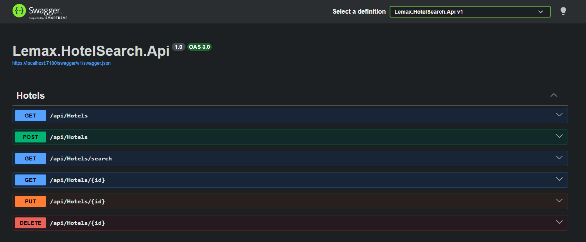
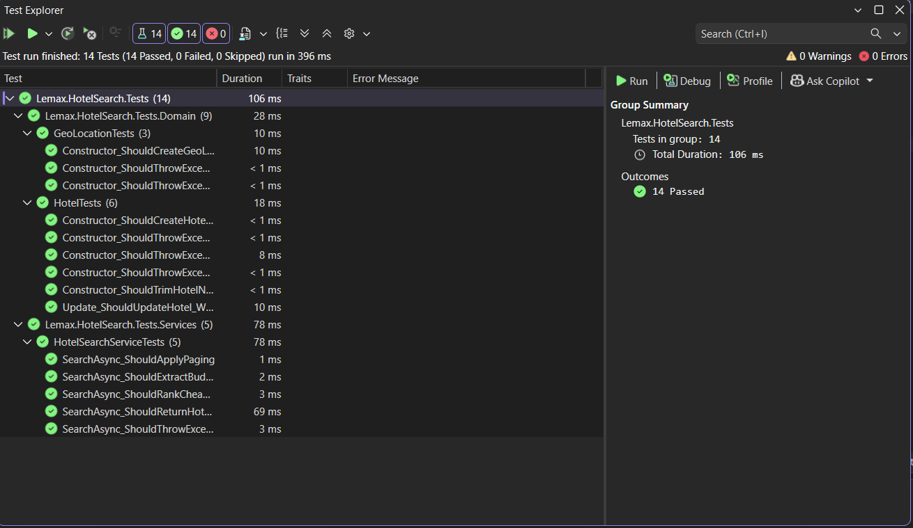

# Lemax Hotel Search API

Proof-of-concept JSON REST API for hotel search, built as a take-home assignment for a Junior Software Developer position at Lemax.

The API supports hotel CRUD operations and hotel search based on a user prompt. Search extracts a supported location and optional budget, calculates distance, filters by budget, ranks hotels by price and distance, and supports paging.

## Screenshots

### Swagger API



### Unit tests



## Technologies

- C#
- .NET
- ASP.NET Core Web API
- Swagger / OpenAPI
- xUnit
- In-memory storage

## Project Structure

```text
Lemax.HotelSearch.Api
Lemax.HotelSearch.Application
Lemax.HotelSearch.Domain
Lemax.HotelSearch.Infrastructure
Lemax.HotelSearch.Tests
```

## Features

- Hotel CRUD operations
- Search hotels by user prompt
- Extract supported location from prompt
- Extract optional budget from prompt
- Calculate distance between searched location and hotel location
- Filter hotels by budget
- Rank hotels by cheaper price and shorter distance
- Paging support
- Unit tests for domain and search logic

## API Endpoints

```http
GET    /api/Hotels
POST   /api/Hotels
GET    /api/Hotels/search
GET    /api/Hotels/{id}
PUT    /api/Hotels/{id}
DELETE /api/Hotels/{id}
```

## Create Hotel Example

```json
{
  "name": "Zagreb Central Rooms",
  "price": 55,
  "latitude": 45.8131,
  "longitude": 15.9775
}
```

## Search Example

```http
GET /api/Hotels/search?prompt=I need a hotel near Zagreb under 100 euros&page=1&pageSize=10
```

Example response:

```json
{
  "items": [
    {
      "name": "Zagreb Central Rooms",
      "price": 55,
      "distanceInKm": 0.42
    }
  ],
  "page": 1,
  "pageSize": 10,
  "totalCount": 1,
  "totalPages": 1
}
```

## Supported Locations

For this proof-of-concept, supported locations are hardcoded:

- Zagreb
- Split
- Dubrovnik
- Zadar
- Rijeka
- Pula
- Rovinj
- Osijek
- Plitvice
- Velika Gorica

In a production version, this could be replaced with a real geocoding provider.

## Search Ranking

Hotels are ranked using a simple weighted score:

```text
score = normalizedPrice * 0.5 + normalizedDistance * 0.5
```

Lower score means a better result. This places cheaper and closer hotels higher in the list.

## Storage

The API uses an in-memory repository.

Hotel data exists only while the application is running. The repository is abstracted through `IHotelRepository`, so a database implementation can be added later without changing the application logic.

## Tests

The solution includes unit tests for:

- GeoLocation validation
- Hotel validation
- Hotel update behavior
- Budget filtering
- Search ranking
- Paging
- Unsupported location handling

Current result:

```text
14 tests passed
0 failed
0 skipped
```

## Example Test Hotels

Use `POST /api/Hotels` to add hotels before testing the search endpoint.

```json
{
  "name": "Zagreb Central Rooms",
  "price": 55,
  "latitude": 45.8131,
  "longitude": 15.9775
}
```

```json
{
  "name": "Zagreb Business Hotel",
  "price": 120,
  "latitude": 45.8005,
  "longitude": 15.9712
}
```

```json
{
  "name": "Split Budget Rooms",
  "price": 65,
  "latitude": 43.5147,
  "longitude": 16.4435
}
```

```json
{
  "name": "Dubrovnik Old Town Hotel",
  "price": 210,
  "latitude": 42.6507,
  "longitude": 18.0944
}
```

```json
{
  "name": "Zadar Harbor Stay",
  "price": 85,
  "latitude": 44.1194,
  "longitude": 15.2314
}
```

```json
{
  "name": "Pula Arena Hotel",
  "price": 110,
  "latitude": 44.8666,
  "longitude": 13.8496
}
```

```json
{
  "name": "Plitvice Forest Lodge",
  "price": 90,
  "latitude": 44.8800,
  "longitude": 15.6160
}
```

```json
{
  "name": "Airport Stay Velika Gorica",
  "price": 75,
  "latitude": 45.7132,
  "longitude": 16.0752
}
```

## Example Search Prompts

```text
I need a hotel near Zagreb
I need a hotel near Zagreb under 100 euros
Find hotel near Split max 120 euros
Find a hotel near Dubrovnik up to 200 euros
I need a hotel near Zadar below 90 euros
Find hotel near Pula less than 150 euros
I need a hotel near Plitvice under 100 euros
Find hotel near Velika Gorica max 80 euros
```

## Use of AI Tools

I used ChatGPT as a development assistant during the assignment.

AI was used for:

- discussing project structure
- reviewing architectural decisions
- identifying edge cases
- planning search logic
- suggesting unit test cases
- improving documentation

All suggestions were reviewed, adjusted, tested, and manually integrated into the solution.
